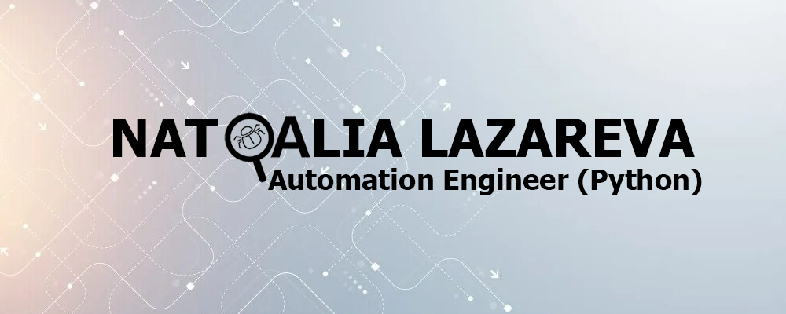

  
# Manual Testing | Test Automation (Python)

### 🚀 Обо мне

Сочетаю ручное тестирование и автоматизацию на Python для повышения качества продукта и оптимизации процесса тестирования.

> 💬 **Открыта к новым проектам и задачам, где смогу применять и развивать навыки QA.**

- 🔍 Manual Testing
- 🧪 Unit, UI & API Testing
- 🐍 Python (Pytest, Selenium, Requests)
- 📋 Test Documentation
- 🐞 Bug Reporting

### 🛠️ Технологии

